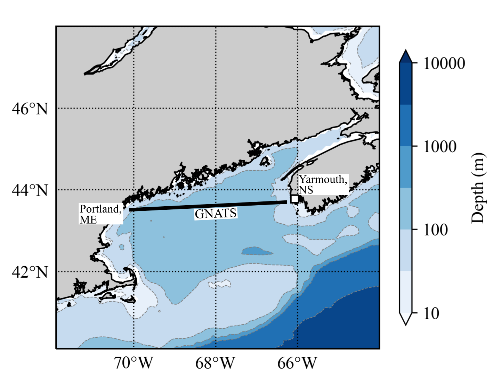

A collection of scripts, notebooks and workflows for working with GNATS (Gulf of Maine North Atlantic Time Series) Slocum glider data.

# GNATS glider data

The GNATS glider data are collected along a transect runnning from approximately Portland, Maine to Yarmouth, Nova Scotia:

There are two gliders: Henry and Grampus. Both have CTDs, radiometers for measuring upwelling radiance ($L_u$) and downwelling irradiance ($E_d$), a WETLabs ECO Puck for chlorophyll-a and colored dissolved organic matter fluorescence and the backscattering coefficient at 532 nm. Grampus also has a Sea-Bird SUNA nitrate sensor and Aanderaa oxygen sensor. Henry's radiometers are at 412 nm, 443 nm, 490 nm, 510 nm, 532 nm, 555 nm & 670 nm, and Grampus's are at 4 380 nm, 443 nm, 490 nm and 532 nm.

## Initial data processing step

Raw data from the gliders are in `\*.dbd` `\*.mbd` or `\*.sbd` files. The `\*.mbd` files are initially processed into a MATLAB `\*.mat` file using `mbd2matlab.m`. 

# Binning

These scripts bin the glider crossings by depth and longitude. The data are binned into 1 m depth intervals, and 0.01$^\circ$ longitude intervals. For the speed of the gliders, 1 - 3 profiles fall within a 0.01$^\circ$ bin. 

**`binMatFile.py`** is a module that is used to bin data for a glider mission, and output it into a netCDF file. 

**`binGliderMatFile.py`** calls `binMatFile` and for a specified glider mission i.e. it processes an individual mission. Will need to update data file directories.

**`batchBinGliderMissions.py`** calls `binMatFile` for all existing glider missions. Will need to update data file directories.

# Dark Count Correction

This script does a dark count correction on the chlorophyll-a fluorometer data. This is a mission wide correction based on the counts in the deepest, darkest waters encountered in the Gulf of Maine: it assumes darkness below 150 m (in the Gulf of Maine, this is within Jordan Basin). Will need to update data file directories.

# Quenching Correction

This directory contains two workflows:

1. **01-ApplyDifferentQuenchingCorrections** applys six different quenching correction methods to all the glider data.
2. **02-AddCorrectedDataToMissionFiles** corrects all the glider chlorophyll fluorescence data with the best performing correction method and adds it to the binned, dark-corrected, mission files.
